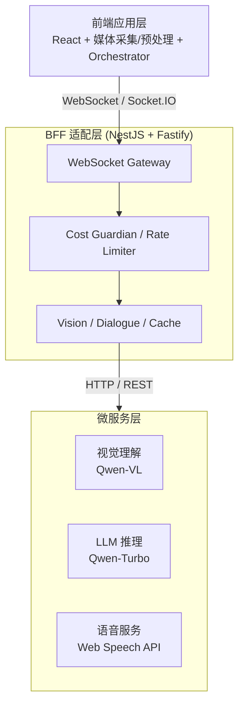

# AI Vision Dialogue

基于浏览器的多模态 AI 对话应用，支持摄像头实时视觉分析、语音识别与合成，采用 BFF 架构与端云协同成本控制策略。

## 技术架构

- 前端：React 18 + TypeScript + Vite
- BFF：NestJS + Fastify + Socket.IO
- 通信：WebSocket（Socket.IO）
- 契约：ts-rest + Zod
- Monorepo：pnpm workspaces + Turbo

## 环境要求

运行本项目前，请确保环境满足以下条件：

- **Node.js**：18+（推荐 20 LTS）
- **包管理器**：pnpm 8+（项目使用 `pnpm-workspace.yaml` 管理 Monorepo）
- **浏览器**：现代浏览器（Chrome / Edge / Safari），需支持：
  - Web Speech API（语音识别 ASR + 语音合成 TTS）
  - getUserMedia（摄像头与麦克风访问）
  - WebSocket

## 快速启动

```bash
pnpm install
pnpm dev        # 同时启动前端(5173)和后端(3000)
```

## demo视频

[点击跳转bilibili观看]()

## 系统架构图

三层解耦：前端应用层 → BFF 适配层 → 微服务层。



## Monorepo 工程结构

```
ai-vision-dialogue/
├── apps/
│   ├── web/                          # 前端主应用 (React 18 + Vite)
│   │   ├── src/
│   │   │   ├── main.tsx              # React 入口
│   │   │   ├── App.tsx               # 根组件
│   │   │   ├── components/           # UI 组件
│   │   │   │   ├── CameraPreview.tsx
│   │   │   │   ├── ChatPanel.tsx
│   │   │   │   ├── VoiceButton.tsx
│   │   │   │   ├── StatusBar.tsx
│   │   │   │   └── CostPanel.tsx
│   │   │   ├── hooks/                # React Hooks
│   │   │   │   └── useMediaCapture.ts
│   │   │   ├── orchestrator/         # 核心调度器
│   │   │   │   └── index.ts
│   │   │   └── services/             # WebSocket 客户端
│   │   │       └── ws-client.ts
│   │   ├── index.html
│   │   ├── vite.config.ts
│   │   ├── tsconfig.json
│   │   └── package.json
│   │
│   └── bff/                          # NestJS BFF 服务
│       ├── src/
│       │   ├── main.ts               # 应用入口
│       │   ├── app.module.ts         # 根模块
│       │   ├── video/                # WebSocket 视频网关
│       │   ├── vision/               # 视觉理解服务
│       │   ├── dialogue/             # 对话服务
│       │   ├── cost/                 # 成本控制
│       │   └── cache/                # 缓存服务
│       ├── test/
│       ├── nest-cli.json
│       ├── tsconfig.json
│       └── package.json
│
├── packages/
│   ├── shared/                       # 公共类型（前后端共享）
│   │   ├── src/types/                # media / vision / dialogue / cost / websocket
│   │   └── package.json
│   ├── config/                       # Zod 配置管理
│   │   ├── src/schema.ts
│   │   └── package.json
│   ├── contract/                     # ts-rest 前后端契约
│   │   ├── src/index.ts
│   │   └── package.json
│   ├── audio-utils/                  # ASR/TTS 封装
│   │   ├── src/asr.ts
│   │   ├── src/tts.ts
│   │   └── package.json
│   └── token-compressor/             # Token 压缩算法
│       ├── src/compress/             # Canvas 图像压缩
│       ├── src/detect/               # 帧间变化检测
│       ├── src/hash/                 # 感知哈希
│       ├── src/optimize/             # Token 优化
│       ├── src/pipeline/             # 压缩管道
│       └── package.json
│
├── turbo.json                        # Turbo pipeline
├── pnpm-workspace.yaml
├── package.json
└── README.md
```

## 第三方依赖

本项目基于以下开源库与框架构建：

| 依赖 | 版本 | 用途 |
|------|------|------|
| React | ^18.2.0 | 前端 UI 框架 |
| react-dom | ^18.2.0 | React DOM 渲染 |
| Vite | ^5.0.8 | 前端构建工具与开发服务器 |
| TypeScript | ^5.3.3 | 全栈类型系统 |
| NestJS | ^10.3.0 | BFF 后端框架 |
| @nestjs/platform-fastify | ^10.3.0 | NestJS Fastify 适配器 |
| @nestjs/platform-socket.io | ^10.3.0 | NestJS WebSocket 适配器 |
| @nestjs/websockets | ^10.3.0 | NestJS WebSocket Gateway |
| @nestjs/axios | ^3.0.1 | BFF HTTP 客户端 |
| Socket.IO | ^4.7.4 | 前后端实时双向通信 |
| ts-rest | ^3.33.0 | 前后端类型安全契约 |
| Zod | ^3.22.4 | 运行时配置校验与接口契约 |
| sharp | ^0.35.1 | 服务端图像处理（token-compressor） |
| Web Speech API | 浏览器原生 | 语音识别（ASR）与语音合成（TTS） |

## 原创功能说明

以下功能为本项目自行设计实现，非第三方库直接提供：

- **端云协同成本控制框架**
  - 本项目最核心的目标之一，就是在大模型 API 调用成本和多模态实时性之间找平衡。我从前端采集层开始设计，把 `Canvas` 压缩、帧间变化检测放在浏览器侧先做一轮过滤，再把必要的数据通过 WebSocket 发到 BFF；BFF 侧再用场景分类、RPM 限流、LRU 缓存做第二、第三轮过滤，最后才调用视觉/语言模型。整条链路是端到端贯通的，不是只在某一层做简单节流。
  - 为了让成本控制可视化，我在前端加了一个 `CostTracker`，按 `Ctrl+Shift+D` 可以调出成本面板，实时显示 API 调用次数、Token 消耗、预估费用和当前 RPM，演示的时候比较直观。

- **token-compressor 帧级压缩引擎**
  - 这部分我把它抽成了一个独立的 npm workspace 包 `@ai-vision/token-compressor`，前后端都能引用。设计思路是“管道 + 策略”：把图像采集、自适应压缩、变化检测、感知哈希、Token 优化决策串成一条流水线，每个环节都用接口抽象出来，方便以后替换算法。
  - 灵感上参考了阿里巴巴在视觉大模型 Token 压缩方面的一些研究思路（比如通过感知哈希和动态分辨率来减少冗余视觉 Token），但具体实现是我根据自己的场景简化和改写的，没有直接照搬。
  - 主要模块包括：`CanvasCompressor` 做前端压缩、`PixelDiffDetector` 做帧间差异、`PerceptualHashStrategy` 做感知哈希去重、`TokenOptimizer` 根据 RPM 决定是否发送以及推荐压缩档位。

- **对话状态机调度器（Orchestrator）**
  - 多模态对话里同时有语音输入、摄像头画面、AI 回复、语音播报好几个异步事件，容易乱。我自己写了一个 `Orchestrator`，把对话过程抽象成 `idle → listening → capturing → processing → speaking` 五个状态，每个状态下能做什么、不能做什么都写清楚了。
  - 比如用户按住空格时进入 `listening`，松开时停止 ASR 并把最终结果送进下一状态；ASR 识别完成后自动捕获一帧画面，然后一起发给 BFF；BFF 返回结果后进入 `speaking` 调用 TTS；按 ESC 可以强制中断当前轮次。这个状态机帮我理清了多模态之间的时序关系。

- **BFF Cost Guardian 成本守卫**
  - 这是 BFF 层的成本控制入口。我实现了场景分类（Blank/Static/Transition/Normal）、令牌桶限流（默认 60 RPM 滚动窗口）、动态分辨率档位选择（RPM 高时自动降到 384 或 256），以及基于感知哈希的 LRU 缓存复用。
  - 场景分类目前先做了简单规则：payload 特别小判为 Blank；缓存命中或哈希连续相同判为 Static；这些帧直接跳过视觉 API。后面如果想做得更细，可以替换成真正的轻量分类模型。

- **自定义 WebSocket 通信协议**
  - 前后端没有走 REST，而是基于 Socket.IO 自己定义了一套事件协议，包括 `frame`、`dialogue`、`metrics` 三大类，以及 `frame:skipped`、`frame:rate-limited`、`dialogue:error` 等降级/错误事件。
  - 所有 payload 都用 `packages/contract` 里的 Zod schema 做运行时校验，保证前后端类型一致，也避免非法数据触发异常。

- **快捷键与降级交互设计**
  - 为了让演示更自然，我设计了空格键按住说话、松开结束、ESC 打断的交互；摄像头权限被拒或网络断开时，会降级为纯文字对话并给出友好提示；BFF 不可用时也能本地提示用户，而不是直接白屏。

## 核心亮点：token-compressor

`token-compressor` 是我为这个项目单独抽出来的一个**通用压缩包**，放在 `packages/token-compressor` 里，以 `@ai-vision/token-compressor` 的名字被前端 `apps/web` 和 BFF `apps/bff` 同时引用。之所以把它独立成包，是因为我觉得这套“图像压缩 + 变化检测 + 哈希去重 + Token 优化”的逻辑不只在这个 AI 视觉对话项目里能用，以后只要是有视频帧/图片流需要控制大模型调用成本的场景，都可以直接拿过去**复用**。

### 设计思路

整体设计我借鉴了“**管道 + 策略**”的模式：把一帧画面的处理拆成几个可替换的步骤，每一步只干一件事，最后由 `FramePipeline` 串起来。这样做的好处是，以后如果想换一种压缩算法、换一种哈希方式，或者换一种 RPM 调度策略，只需要实现对应接口然后替换掉就行，不用重写整个流程。这个思路部分受到了阿里巴巴在视觉大模型 Token 压缩相关研究的启发——他们有一些通过感知哈希、动态分辨率来压缩视觉 Token 的思路，我觉得很适合我们这种实时视频对话的场景，所以就按照自己的理解做了实现和改造。

### 流水线步骤

一条完整帧的处理链路如下：

1. **自适应压缩（AdaptiveCompressor + CanvasCompressor）**
   - 前端拿到 `HTMLVideoElement` 后，先通过 Canvas 缩放到最大 512x512，JPEG quality 默认 0.7。
   - `AdaptiveCompressor` 会根据当前 RPM 比例自动选择档位：RPM 超过限流 80% 时降到 256x256/quality 0.5；超过 50% 时降到 384x384/quality 0.6；否则保持默认 512x512/quality 0.7。
   - 这样在高并发演示时，可以牺牲一点画质来保住服务不挂、费用不炸。

2. **帧间变化检测（ChangeDetector + PixelDiffDetector）**
   - 在浏览器侧先用 `PixelDiffDetector` 对相邻帧做像素采样差异计算（默认每 16 个像素采样 1 个，减少计算量）。
   - 如果变化分数低于阈值（默认 0.15），就认为画面基本没动，直接把 `shouldSend` 置为 false，这一帧就不会发 WebSocket，也不会进视觉模型。
   - 这个对演示特别有用：用户不动的时候不会一直刷 API。

3. **感知哈希去重（PerceptualHashStrategy）**
   - BFF 侧收到帧后，会用 `PerceptualHashStrategy` 计算一个 8x8 灰度缩略图的 64 位感知哈希（实现的是经典的 aHash 算法）。
   - 如果当前帧的哈希和上一帧完全一致，就直接跳过 API 调用，返回 `frame:skipped` 给前端。
   - 同时这个哈希也会作为 LRU 缓存的 key，如果缓存命中，就直接返回上次的视觉描述结果，进一步省钱。

4. **Token 优化决策（TokenOptimizer）**
   - 综合变化分数和 RPM 负载做最终决策：变化太小不发；RPM 超过 90% 且变化分数不够大也不发；其他情况才允许调用视觉 API。
   - 同时返回当前负载下推荐的压缩参数，供前端动态调整下一帧的输出质量。

### 独立复用能力

因为这个包没有依赖任何前端 UI 或后端业务代码，只依赖 `sharp`（BFF 侧用，浏览器侧打包时不会静态引入）和浏览器原生 Canvas，所以它可以被当成一个普通工具库引用：

- 前端：`new FramePipeline({ maxWidth: 512, quality: 0.7 })` 处理摄像头帧。
- 后端：直接用 `PerceptualHashStrategy` 做图片去重，用 `TokenOptimizer` 做限流决策。
- 后续如果要接其他视觉模型，只要保证输入是 base64 图片，都可以复用这套压缩链路。

### 实际效果

在本地演示场景中，如果用户静止不动，大概 80% 以上的帧会在前端或 BFF 层被过滤掉；即使画面有轻微抖动，感知哈希去重和缓存复用也能避免重复调用。粗略估算，相比“每帧都原图直传视觉模型”的方案，API 调用次数和 Token 消耗大概能减少一半以上（具体比例取决于画面变化频率和并发量）。

## 成本控制策略

成本控制是这个项目评审的一个重要加分项，所以我从前端到 BFF 到缓存层都做了相应设计。整体思路是“能不发就不发，能小发就不大发，发了能复用就复用”。下面是具体的分层策略：

### 1. 前端 Canvas 图像压缩

- 浏览器拿到摄像头原始画面后，先在 `CanvasCompressor` 里缩放到最大 512x512，输出 JPEG 格式，quality 默认 0.7。
- 为什么不直接传原图？因为视觉模型一般按图片尺寸和 Token 数计费，720p 甚至 1080p 的原图会贵很多，而 512x512 对“识别画面里是什么”已经够用了。
- 压缩是在浏览器本地完成的，不占用服务器资源，也减少了 WebSocket 传输带宽。

### 2. 帧间变化检测 + 感知哈希去重

- **前端变化检测**：`PixelDiffDetector` 对相邻帧做像素级差异采样。如果画面变化很小（比如用户只是轻微晃动），就直接丢弃，不发到后端。
- **后端感知哈希去重**：BFF 收到帧后计算 64 位感知哈希，和该用户上一帧比对。哈希相同说明画面几乎没变，直接跳过视觉 API。
- 这两层去重叠加起来，对于静态或慢变场景能过滤掉绝大部分冗余调用。

### 3. BFF 三级过滤（Cost Guardian）

BFF 层不是收到帧就直接调视觉模型，而是先过三道闸：

- **第一级：场景分类**。目前先做了规则判断：payload 过小视为 Blank 帧；哈希连续一致视为 Static 帧；这些都会被拦截。后面可以扩展成轻量模型分类 Transition/Normal 等更细的场景。
- **第二级：动态分辨率降级**。根据全局 RPM 自动选择压缩档位（512 → 384 → 256），并把档位通过 `frame:tier` 事件推送给前端，让前端下一帧按更低质量输出。
- **第三级：调用频次限制**。用令牌桶算法限制每个客户端 60 RPM，超过后直接返回 `frame:rate-limited`，避免刷爆 API。

### 4. 动态分辨率降级

- 当 RPM 达到限流的 50% 时，画质降到 384x384/quality 0.6；达到 80% 时进一步降到 256x256/quality 0.5。
- 这个逻辑同时存在于前端的 `AdaptiveCompressor` 和后端的 `CostGuardian`/`TokenOptimizer` 中，形成前后端协同：后端负责统计真实负载并下发档位，前端负责提前调整下一帧的输出参数。
- 降级是平滑的，不是一刀切：只有负载高时才降，负载下来后自动恢复默认档位。

### 5. 对话上下文滑动窗口 + 摘要

- BFF 的 `DialogueService` 会维护每个用户的对话历史，但历史消息不能无限长，否则 Token 越滚越多。
- 目前实现了固定窗口策略：只保留最近 N 轮对话作为上下文；超出窗口的旧消息会被丢弃，避免单次调用 Token 爆炸。
- 时间允许的话，后面还可以加一层“摘要压缩”：把更早的对话总结成一段话再放进上下文，这样能在保留语义的同时进一步减少 Token。

### 6. LRU 缓存复用

- BFF 的 `CacheService` 用感知哈希作为 key，把视觉模型的分析结果缓存 5 分钟，命中后直接把缓存结果返回，不再调用模型。
- 缓存采用 LRU 策略：每次访问会把 key 移到末尾，过期或被淘汰的条目自动清理。
- 这个对重复展示同一物体的场景特别有效，比如用户举着同一个东西连续问几个问题，只有第一次需要真正调用视觉模型。
